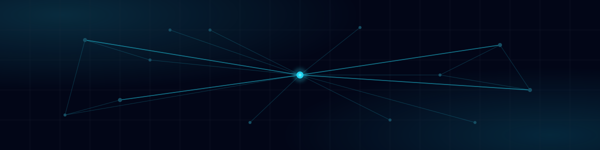

  

  # Mestyx · Product & Infra Builder

  **À partir de problématiques métier, je conçois des systèmes clé en main (app + infra) en m'appuyant sur une stack IA et du self-hosting pour garder le contrôle des données et la fiabilité en production.**

  

  *Grenoble, France*

  [Français](#fr) · [English](#en)

  
  
  
  
  

---

# Français

## À propos

Je conçois des systèmes complets plutôt que des bouts de code isolés : application, infrastructure, sauvegardes, monitoring et exploitation sont pensés ensemble dès le départ. Je privilégie le self-hosting et la souveraineté des données : savoir où tournent les services, comment ils sont sauvegardés, comment les remettre sur pied en cas de problème. Je cadre les cycles, documente les décisions d'architecture et valide la qualité avant la mise en production (runbooks, tests, definition of done).

L'IA produit une partie du code et de l'assemblage, mais l'architecture, les choix techniques et l'exploitation restent sous ma main. Je m'appuie sur une stack IA locale (RAG sur ma documentation, outils intégrés à l'IDE) pour la recherche, la génération ciblée et la documentation.

Avant le développement, j'ai travaillé plus de dix ans en maintenance industrielle et radiocommunications : diagnostic, fiabilité, sens du service. J'en garde une approche terrain, et je préfère des architectures simples, documentées et exploitables plutôt que des stacks brillantes mais fragiles.

## Ce que je construis

Je pars de besoins métier concrets (associations, PME, industrie) et je conçois des outils et des systèmes qui font gagner du temps : plateforme associative, console d'infrastructure, stack IA locale, backend e-commerce réutilisable. Mes projets principaux sont publics sur GitHub, avec une organisation dédiée pour mes travaux d'infra et de produits.

## Compétences

**Infrastructure & Ops**

`pfSense` · `WireGuard` · `systemd` · `Bash`

**Backend**

`RSpec` · `Devise` · `Pundit` · `Drizzle` · `Hono` · `APIs REST`

**Frontend**

`shadcn/ui` · `Hotwire (Stimulus / Turbo)` · `accessibilité` · `responsive design`

**Data & IA locale**

`RAG` · `embeddings` · `OpenWebUI` · `MCP`

**Automation & Agents**

`Hermes Agent` · `Memorizer` · `Hindsight` · `Firecrawl`

**Observabilité & Sécurité**

`Uptime Kuma` · `Beszel` · `Wazuh` · `PBS (backups)` · `Agent Vault`

**Méthodes & Craft**

`ADR` · `runbooks` · `Cursor IDE`

## Projets sélectionnés

- [**SaaS-Multisite-Platform**](https://github.com/Mestyx-dev/SaaS-Multisite-Platform) — CMS + commerce multi-marques : admin SaaS, API Hono, storefronts SSR, isolation tenant. Monorepo TypeScript, Apache-2.0, déployé sur Dokploy. [Landing](https://mestryx.dev/)
- [**Grenoble Roller**](https://github.com/Grenoble-roller/Grenoble-Roller-Website) — application Rails 8.1 en production pour une association de roller : initiations, événements hebdomadaires, inscriptions, prêts de rollers, boutique et adhésions. 90 membres actifs, 240 inscriptions gérées. [Site](https://grenoble-roller.org/)
- [**Mestyx-AI**](https://github.com/FlowTech-Lab/FlowTech-AI) — stack IA locale RAG (Ollama, Qdrant, OpenWebUI, MCP) self-hosted en Docker.
- **Infrastructure M3stryӼ** — homelab Proxmox : 50+ services déployés via Dokploy (hub + VPS), sauvegardes PBS, observabilité Uptime Kuma / Beszel / Wazuh.

## Infrastructure & self-hosting

- Hyperviseur Proxmox (T640) + edge pfSense, développement sur workstation dédiée.
- 50+ services déployés via Dokploy, hub homelab + VPS.
- Sauvegardes PBS, ~11 TB.
- Observabilité : Uptime Kuma (22+ sondes), Beszel, Wazuh, alertes Discord.
- Documentation SSOT Memorizer + runbooks Git, automation n8n.
- Uptime > 99 % sur les services critiques.

## Parcours

- Plus de dix ans en maintenance industrielle et radiocommunications avant le développement.
- Formation initiale en maintenance, puis montée en compétences full-stack et back-end certifiée.
- Aujourd'hui : conception et exploitation de systèmes complets pour associations, PME et industrie.

  <a href="https://portfolio.mestyx.me/#contact"><strong>Un projet, une mission ou une question ? Écrivez-moi</strong></a>

---

# English

## About me

I design complete systems rather than isolated pieces of code: application, infrastructure, backups, monitoring and operations are planned together from the start. I favour self-hosting and data sovereignty: knowing where services run, how they are backed up, how to bring them back after an incident. I scope cycles, document architecture decisions and validate quality before production (runbooks, tests, definition of done).

AI produces part of the code and assembly, but architecture, technical choices and operations stay under my control. I rely on a local AI stack (RAG over my documentation, tools integrated in the IDE) for research, targeted generation and documentation.

Before development, I spent over ten years in industrial maintenance and radio communications: diagnosis, reliability, service. It gave me a field-first approach. I prefer simple, documented, operable architectures over flashy but fragile stacks.

## What I build

I start from concrete business needs (associations, SMBs, industry) and design tools and systems that save time: an association platform, an infrastructure console, a local AI stack, a reusable e-commerce backend. My main projects are public on GitHub, with a dedicated organisation for my infra and product work.

## Skills

**Infrastructure & Ops**

`pfSense` · `WireGuard` · `systemd` · `Bash`

**Backend**

`RSpec` · `Devise` · `Pundit` · `Drizzle` · `Hono` · `REST APIs`

**Frontend**

`shadcn/ui` · `Hotwire (Stimulus / Turbo)` · `accessibility` · `responsive design`

**Data & local AI**

`RAG` · `embeddings` · `OpenWebUI` · `MCP`

**Automation & Agents**

`Hermes Agent` · `Memorizer` · `Hindsight` · `Firecrawl`

**Observability & Security**

`Uptime Kuma` · `Beszel` · `Wazuh` · `PBS (backups)` · `Agent Vault`

**Methods & Craft**

`ADR` · `runbooks` · `Cursor IDE`

## Selected projects

- [**SaaS-Multisite-Platform**](https://github.com/Mestyx/SaaS-Multisite-Platform) — multi-brand CMS + commerce: SaaS admin, Hono API, SSR storefronts, tenant isolation. TypeScript monorepo, Apache-2.0, deployed on Dokploy. [Landing](https://mestryx.dev/)
- [**Grenoble Roller**](https://github.com/Grenoble-roller/Grenoble-Roller-Website) — Rails 8.1 app in production for a roller-skating association: initiations, weekly events, sign-ups, roller rentals, shop and memberships. 90 active members, 240 sign-ups handled. [Site](https://grenoble-roller.org/)
- [**Mestyx-AI**](https://github.com/FlowTech-Lab/FlowTech-AI) — self-hosted local AI stack with RAG (Ollama, Qdrant, OpenWebUI, MCP), running in Docker.
- **Infrastructure M3stryӼ** — Proxmox homelab: 50+ services deployed through Dokploy (hub + VPS), PBS backups, Uptime Kuma / Beszel / Wazuh observability.

## Infrastructure & self-hosting

- Proxmox hypervisor (T640) + pfSense edge, development on a dedicated workstation.
- 50+ services deployed through Dokploy, homelab hub + VPS.
- PBS backups, ~11 TB.
- Observability: Uptime Kuma (22+ probes), Beszel, Wazuh, Discord alerts.
- Memorizer SSOT documentation + Git runbooks, n8n automation.
- Uptime above 99% on critical services.

## Background

- Over ten years in industrial maintenance and radio communications before moving to development.
- Initial maintenance training, then certified full-stack and backend growth.
- Today: designing and operating complete systems for associations, SMBs and industry.

  <a href="https://portfolio.mestyx.me/#contact"><strong>Working on a project, a mission or a question? Get in touch</strong></a>
    
  Complete systems, self-hosted by default.

